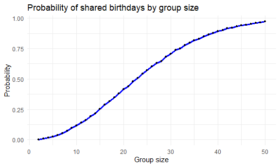

Homework 5
================
Eman Ibrahim (ei2291)

## Problem 1

``` r
set.seed(1)
```

Writing function to test

``` r
birthday_sim = function(n){
 birthdays = sample(1:365, size = n, replace = TRUE)
 any(duplicated(birthdays))
}
```

test:

``` r
birthday_sim(10)
```

    ## [1] FALSE

Run the function 10,000 times for each group (2 to 50)

``` r
sim_results = 
  expand_grid(
    group_size = 2:50,
    iter = 1:10000
  ) |> 
  mutate(
    shared = map_lgl(group_size, birthday_sim)
  )
```

Probability of shared birthdays:

``` r
prob_results = 
  sim_results |> 
  group_by(group_size) |> 
  summarize(prob_shared = mean(shared))
```

Plot:

``` r
prob_results |> 
  ggplot(aes(x=group_size, y=prob_shared))+
  geom_line(color="blue", linewidth = 1.2)+
  geom_point(size=1.2)+
  labs(
    title = "Probability of shared birthdays by group size",
    x= "Group size",
    y= "Probability"
  )+
  theme_minimal()
```



Based on the result of our plot, we can see that the probability of a
shared birthday increases as group size increases. At about a group size
of 23, the chance(probability) is about 50%. By around a group size of
50, there is almost 100% chance of having a shared birthday. We see that
the probability increases very fast even when there are many possible
birthdays.
