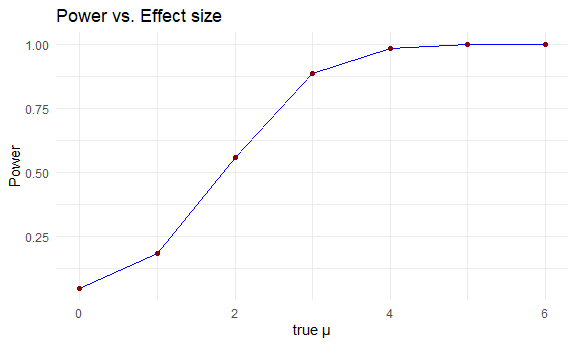
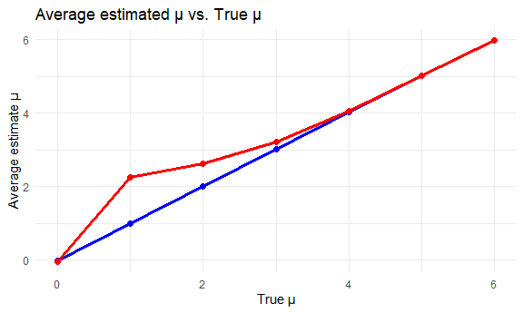

Homework 5
================
Eman Ibrahim (ei2291)

## Problem 1

``` r
set.seed(1)
```

Writing function to test

``` r
birthday_sim = function(n){
 birthdays = sample(1:365, size = n, replace = TRUE)
 any(duplicated(birthdays))
}
```

test:

``` r
birthday_sim(10)
```

    ## [1] FALSE

Run the function 10,000 times for each group (2 to 50)

``` r
sim_results = 
  expand_grid(
    group_size = 2:50,
    iter = 1:10000
  ) |> 
  mutate(
    shared = map_lgl(group_size, birthday_sim)
  )
```

Probability of shared birthdays:

``` r
prob_results = 
  sim_results |> 
  group_by(group_size) |> 
  summarize(prob_shared = mean(shared))
```

Plot:

``` r
prob_results |> 
  ggplot(aes(x=group_size, y=prob_shared))+
  geom_line(color="blue", linewidth = 1.2)+
  geom_point(size=1.2)+
  labs(
    title = "Probability of shared birthdays by group size",
    x= "Group size",
    y= "Probability"
  )+
  theme_minimal()
```


Based on the result of our plot, we can see that the probability of a
shared birthday increases as group size increases. At about a group size
of 23, the chance(probability) is about 50%. By around a group size of
50, there is almost 100% chance of having a shared birthday. We see that
the probability increases very fast even when there are many possible
birthdays.

## Problem 2

writing function:

``` r
sim_one = function(true_mu){
  x= rnorm(30, mean = true_mu, sd=5)
  test= t.test(x, mu=0)
  
  tidy(test) |> 
    select(estimate, p.value)
}
```

testing:

``` r
sim_one(0)
```

    ## # A tibble: 1 × 2
    ##   estimate p.value
    ##      <dbl>   <dbl>
    ## 1   -0.142   0.866

running 5,000 simulations for mu = 1,2,3,4,5,6:

``` r
sim_results=expand_grid(
  true_mu = 0:6,
  iter = 1:5000
) |> 
  mutate(
    out=map(true_mu, sim_one)
  ) |> 
  unnest(out)
```

computing power for each:

``` r
power_results = 
  sim_results |> 
  group_by(true_mu) |> 
  summarize(
    power=mean(p.value<0.05)
  )
```

Making plot 1: Power and effect size

``` r
power_results |> 
  ggplot(aes(x=true_mu, y=power))+
  geom_line(color="blue")+
  geom_point(size=1.5, color = "darkred")+
  labs(
    title = "Power vs. Effect size",
    x = "true μ",
    y= "Power"
  )+
  theme_minimal()
```



Power and true mean are directly proportional. In the plot we can see
that as true mean increases, so does the power. And initially when the
mean was small, the test doesn’t reject the null but as the effect size
increases, the t-test is more likely to reject the null. From true mean
2 to 3, power rises very rapidly and approaches 1 at around true mean of
4.

compute average estimate for plot2

``` r
est_results=
  sim_results |> 
  group_by(true_mu) |> 
  summarize(
    avg_est = mean(estimate),
    avg_est_rejected = mean(estimate[p.value<0.05])
  )
```

Plotting both:

``` r
est_results |> 
  ggplot(aes(x=true_mu))+
  geom_line(aes(y=avg_est), color="blue", size=1.2)+
  geom_point(aes(y=avg_est), color="blue", size=2)+
  geom_line(aes(y=avg_est_rejected), color="red", size=1.2)+
  geom_point(aes(y=avg_est_rejected), color="red", size=2)+
  
  labs(
    title = "Average estimated μ vs. True μ",
    x = "True μ",
    y = "Average estimate μ"
  )+
  theme_minimal()
```

    ## Warning: Using `size` aesthetic for lines was deprecated in ggplot2 3.4.0.
    ## ℹ Please use `linewidth` instead.
    ## This warning is displayed once every 8 hours.
    ## Call `lifecycle::last_lifecycle_warnings()` to see where this warning was
    ## generated.



No, the sample average of estimate mean across tests for when null is
rejected is not equal to the true mean, especially when the true mean
value (μ) is small. When the μ is small, the test only rejects when the
average estimated μ is very large, so now the average of estimate μ in
the rejected sample is biased upward, which is a form of selection bias.
But, when μ is large, more rejection happens, and the average estimate μ
becomes closer to the true μ.

## Problem 3

read data

``` r
homicides = 
  read_csv("https://raw.githubusercontent.com/washingtonpost/data-homicides/master/homicide-data.csv") |> 
  janitor::clean_names()
```

    ## Rows: 52179 Columns: 12
    ## ── Column specification ────────────────────────────────────────────────────────
    ## Delimiter: ","
    ## chr (9): uid, victim_last, victim_first, victim_race, victim_age, victim_sex...
    ## dbl (3): reported_date, lat, lon
    ## 
    ## ℹ Use `spec()` to retrieve the full column specification for this data.
    ## ℹ Specify the column types or set `show_col_types = FALSE` to quiet this message.

The dataset has 52,179 recorded homicides from 50 U.S. cities, and each
row is one homicide case.The data was colleced by The Washington Post
from public records and police departments. The key variables are city,
state, reported date, location (`lat` and `long`), victim information
such as first, and last names, age, sex, race, and disposition.

Creating a `city_state` variable and summarizing

``` r
homicide_summary=
  homicides |> 
  mutate(
    city_state = str_c(city, ",", state),
    unsolved=disposition %in% c("Closed without arrest", "Open/No arrest")
  ) |> 
  group_by(city_state) |> 
  summarize(
    total=n(),
    unsolved=sum(unsolved)
  )

homicide_summary
```

    ## # A tibble: 51 × 3
    ##    city_state     total unsolved
    ##    <chr>          <int>    <int>
    ##  1 Albuquerque,NM   378      146
    ##  2 Atlanta,GA       973      373
    ##  3 Baltimore,MD    2827     1825
    ##  4 Baton Rouge,LA   424      196
    ##  5 Birmingham,AL    800      347
    ##  6 Boston,MA        614      310
    ##  7 Buffalo,NY       521      319
    ##  8 Charlotte,NC     687      206
    ##  9 Chicago,IL      5535     4073
    ## 10 Cincinnati,OH    694      309
    ## # ℹ 41 more rows
